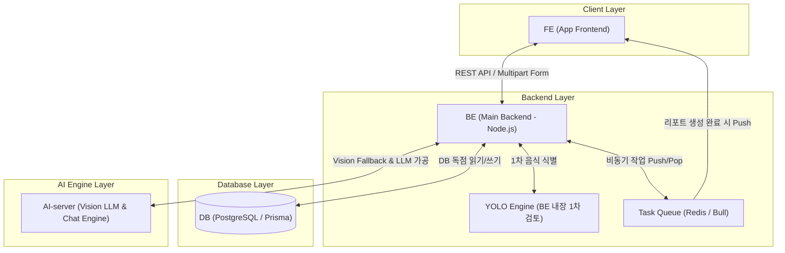

# TAMMY v3 시스템 아키텍처 명세서 (System Architecture)

본 문서는 TAMMY v3의 전체 하드웨어/소프트웨어 아키텍처, 4대 구성 요소 간 연동 방식, 그리고 백엔드 하이브리드 비전(YOLO + Vision LLM) 및 비동기 리포트 생성 파이프라인을 정의합니다.

---

## 1. 시스템 4대 핵심 구성 요소 (Core Components)

---

## 2. 레이어별 세부 아키텍처 역할

### 2.1 FE (App Frontend)
- **1-Tap Quick UI**: 사진 촬영, 리포트 생성, 물/감정/일기/운동 원터치 입력 UI 제공
- **Media Handler**: 식단 사진 촬영 및 원본 이미지 백엔드 전송
- **Deep Link Processor**: 별여행 리포트 생성 완료 푸시 알림 클릭 시 해당 리포트 상세 화면 진입

### 2.2 BE (Main Backend - Node.js Express/Fastify)
- **API Gateway & Auth**: JWT 인증 인터셉터, CORS, 보안 미들웨어 관리
- **Image Resizer & Compressor**: 업로드된 식단 이미지를 512x512 Low-Res로 압축 처리하여 외부 토큰 최소화
- **Embedded YOLO Engine**: 자체 경량 YOLO 모델을 구동하여 식단 사진 1차 검토 (명확 시 외부 API 호출 0원 처리)
- **Task Queue & Worker (Redis/Bull)**: 별여행 리포트 생성을 비동기로 관리하고 FCM/APNs 푸시 알림 발송
- **DB Access Manager**: Prisma ORM을 통한 PostgreSQL 데이터베이스 독점 트랜잭션 관리

### 2.3 DB (Database Layer - PostgreSQL & Prisma)
- **Main RDBMS**: 사용자 프로필, 1-Tap 데일리 기록, 식단 영양 데이터, 별여행 탐사 이력, 대화 내역 저장
- **Vector Extension (Pgvector)**: 2단계 고도화 시 비구조화 대화 이력 및 헬스케어 도메인 지식 RAG 파이프라인 임베딩 저장소 활용

### 2.4 AI-server (Dedicated AI Engine)
- **Multimodal Vision LLM**: BE의 YOLO 1차 검토에서 미식별/불분명 판정 시 Fallback으로 이미지 정밀 분석 수행
- **Empathy Chat & Summary Agent**: 대화 메시지 수신 시 심리 공감 응답 및 관련 감정/웰니스 정보 종합 가공/정리
- **Planet Report Generator**: 별여행 탐사 완료 데이터(식사, 수분, 감정, 생활습관, 회고) 기반 맞춤 리포트 가공

---

## 3. 핵심 아키텍처 파이프라인

### 3.1 하이브리드 Food Vision 파이프라인
1. FE에서 원본 이미지 업로드 -> BE에서 512x512 이미지 리사이징 & 압축
2. BE 내장 YOLO 모델로 1차 인식 -> **성공 시**: 외부 API 호출 0원으로 즉시 200 OK
3. **미식별/불분명 시**: BE가 AI-server(Vision LLM)로 Fallback 분석 요청 -> 고도화 분석 데이터 획득 후 FE 전달

### 3.2 비동기 별여행 리포트 & 푸시 알림 파이프라인
1. 사용자가 별여행 탐사 출발 -> BE에서 Task Queue에 작업 Push -> 사용자에게 즉시 202 Accepted 응답
2. 백그라운드 Worker가 AI-server에 맞춤 리포트 생성 요청 -> 리포트 DB 저장
3. Push Notification 서비스(FCM/APNs)를 통해 디바이스로 완료 알림 전송

### 3.3 대화 DB 선저장 및 AI-server 종합 가공 파이프라인
1. 사용자 메시지 수신 -> BE에서 DB에 즉시 저장
2. BE가 AI-server로 메시지 및 사용자 프로필 전달 -> AI-server 내부에서 심리 공감 응답 및 감정/웰니스 관련 데이터 종합 가공
3. AI-server 가공 결과를 BE가 수령하여 DB 저장 후 FE로 최종 반환
