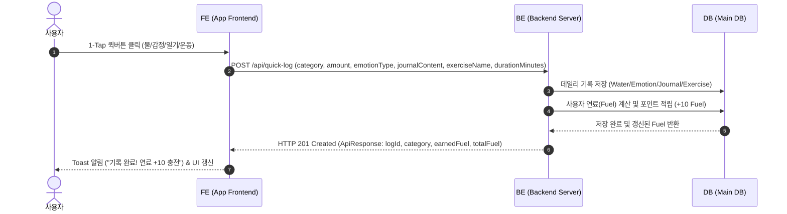
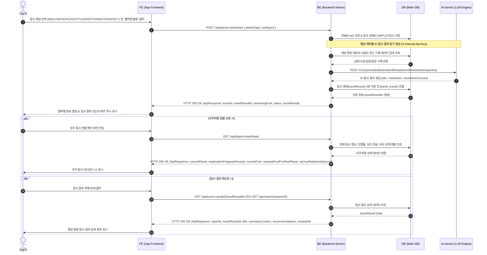
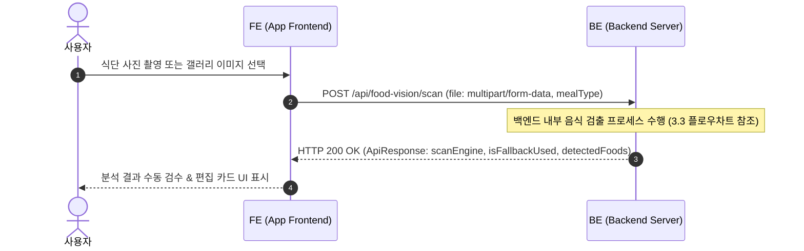
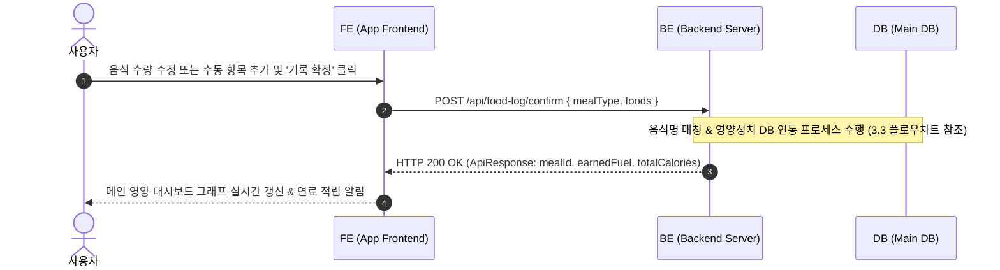
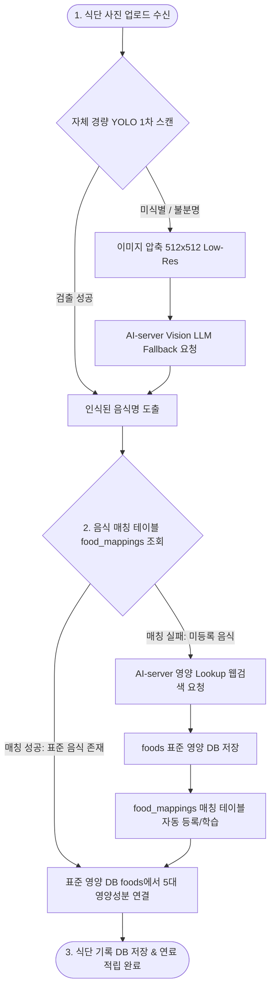
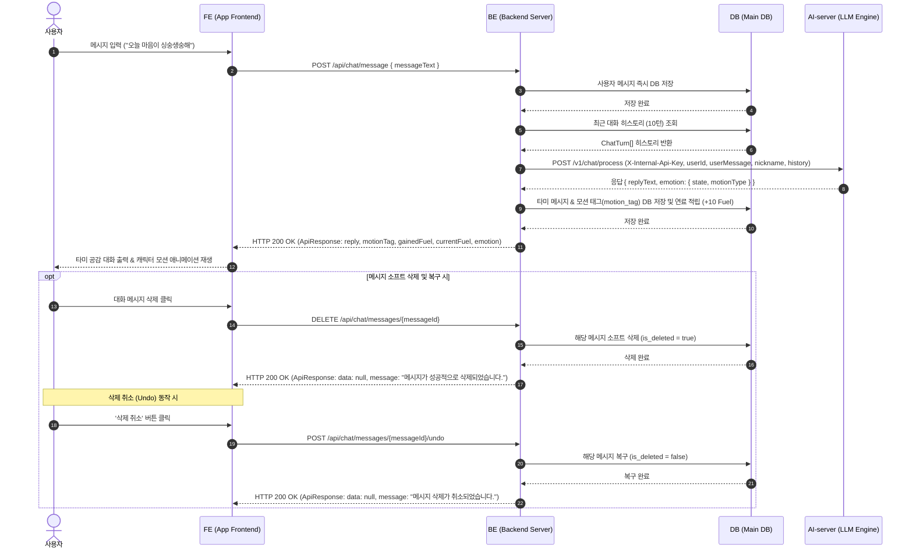
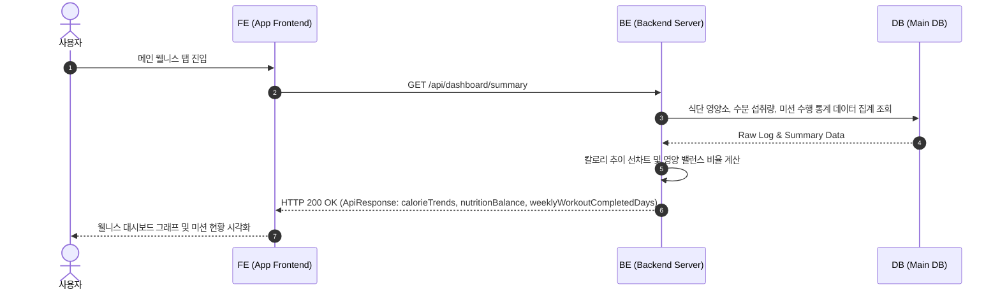
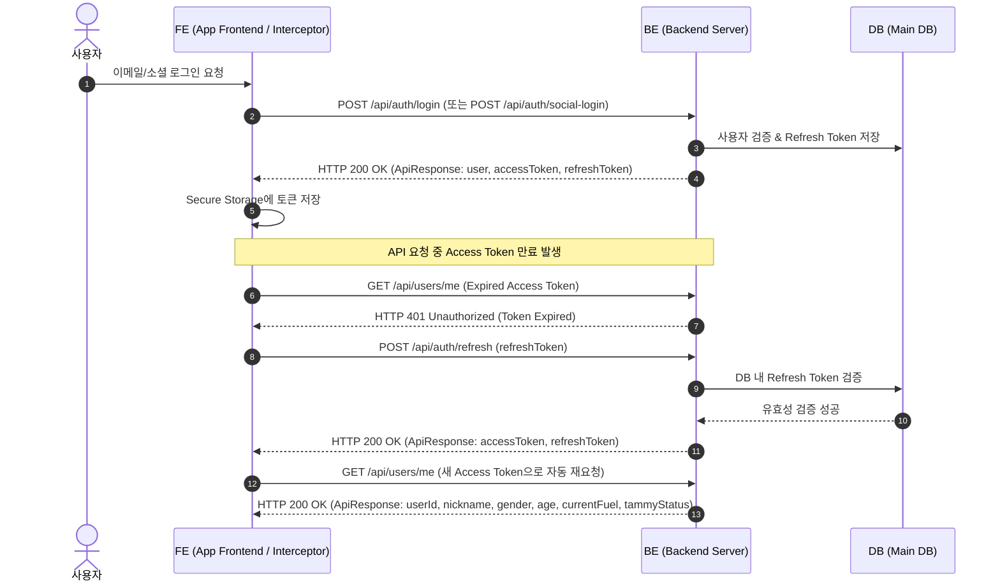
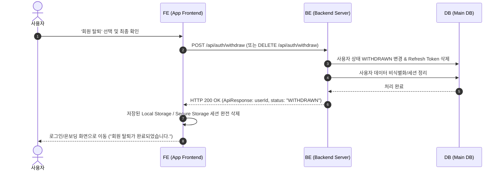

# TAMMY v3 시퀀스 다이어그램 (Sequence Diagrams)

본 문서는 FE, BE, DB, AI-server 간의 데이터 흐름과 시스템 간 인터랙션을 정의합니다. 백엔드 컨트롤러 구현(`src/api/routes`)과 100% 일치하도록 작성되었습니다.

---

## 1. 1-Tap 퀵버튼 기록 & 연료(Fuel) 충전 시퀀스

사용자가 1-Tap 퀵버튼으로 데일리 웰니스 항목을 기록하고 우주 연료(Fuel)를 적립하는 과정입니다.

---

## 2. 별여행 탐사 & 탐사 결과(travelResult) 동기 생성 및 수령 시퀀스

연료를 소진하여 별여행 탐사를 출발하고, BE에서 행성 테마에 맞춰 AI-server (`X-Internal-Api-Key` 인증)로 동기 요청을 보내 탐사 결과(`travelResult`)를 생성하여 즉시 응답으로 수령하는 과정입니다.

---

## 3. 사진 촬영, AI/YOLO 음식 검출 및 영양 매칭 시퀀스

식단 분석 및 기록 과정을 **(3.1) 음식 검출 API 시퀀스**, **(3.2) 식단 확정 API 시퀀스**, 그리고 **(3.3) 백엔드 내부 음식 검출 & AI-RDB 매칭 프로세스 플로우차트**로 명확히 분리하여 정의합니다.

### 3.1 사진 촬영 & 음식 검출 API 시퀀스

식단 사진 업로드 시 백엔드로 이미지를 전달하고 검출된 음식 명칭 및 바운딩 박스를 반환받는 클라이언트-서버 통신 시퀀스입니다.

### 3.2 식단 확정 & 영양 기록 API 시퀀스

사용자 검수 후 식단을 확정하면 영양 성분을 매칭하고 식단 기록을 저장 및 연료를 적립하는 통신 시퀀스입니다.

### 3.3 백엔드 음식 검출 & AI-RDB 매칭 프로세스 (알고리즘 플로우차트)

백엔드 내부에서 수행되는 **(1) YOLO 1차 스캔 & Vision LLM Fallback 검출** 및 **(2) 매칭 테이블(food_mappings) 기반 RDB 영양 DB 매칭 & AI Lookup Fallback** 의사결정 프로세스입니다.

---

## 4. AI 타미 심리 공감 대화 & AI-server 대화 시퀀스

사용자 메시지를 DB에 즉시 저장한 뒤, DB에서 최근 대화 히스토리(`ChatTurn[]`)를 추출하여 **AI-server (`POST /v1/chat/process`)**로 전달하고, 공감 응답 및 감정 상태/캐릭터 반응 모션을 수령하여 저장하는 과정입니다.

---

## 5. 상시 웰니스 대시보드 통계 조회 시퀀스

메인 화면 진입 시 FE가 상시 웰니스 통계(칼로리 추이, 3대 영양소, 수분 섭취, 미션 달성도)를 조회하는 과정입니다.

---

## 6. JWT 로그인 & Access Token 자동 갱신 시퀀스

사용자 로그인 시 토큰 발급 및 API 요청 중 Access Token 만료 시 FE 인터셉터를 통해 Refresh Token으로 자동 재발급받는 과정입니다.

---

## 7. 회원 탈퇴 & 데이터 세션 정리 시퀀스

회원 탈퇴 요청 시 세션을 만료시키고 사용자 상태를 `WITHDRAWN`으로 변경하여 데이터 정리 및 세션을 삭제하는 과정입니다.

