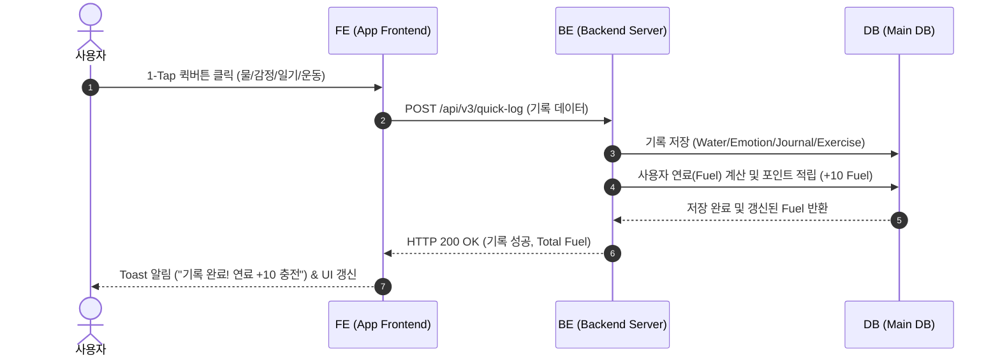
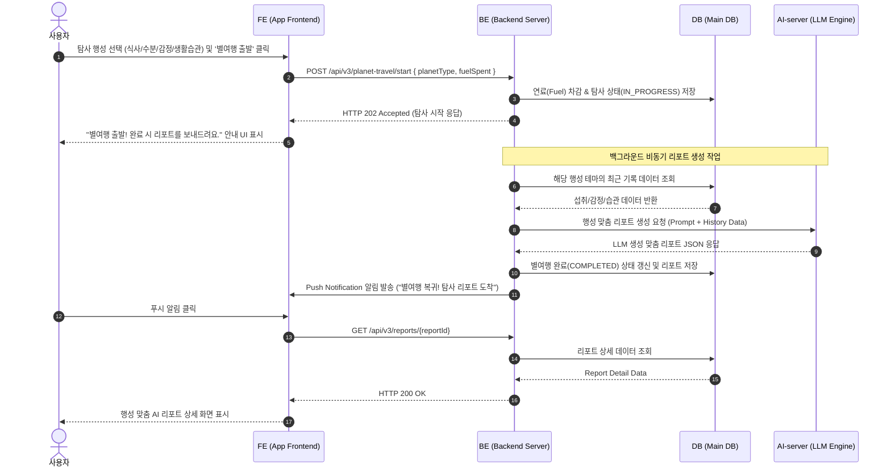
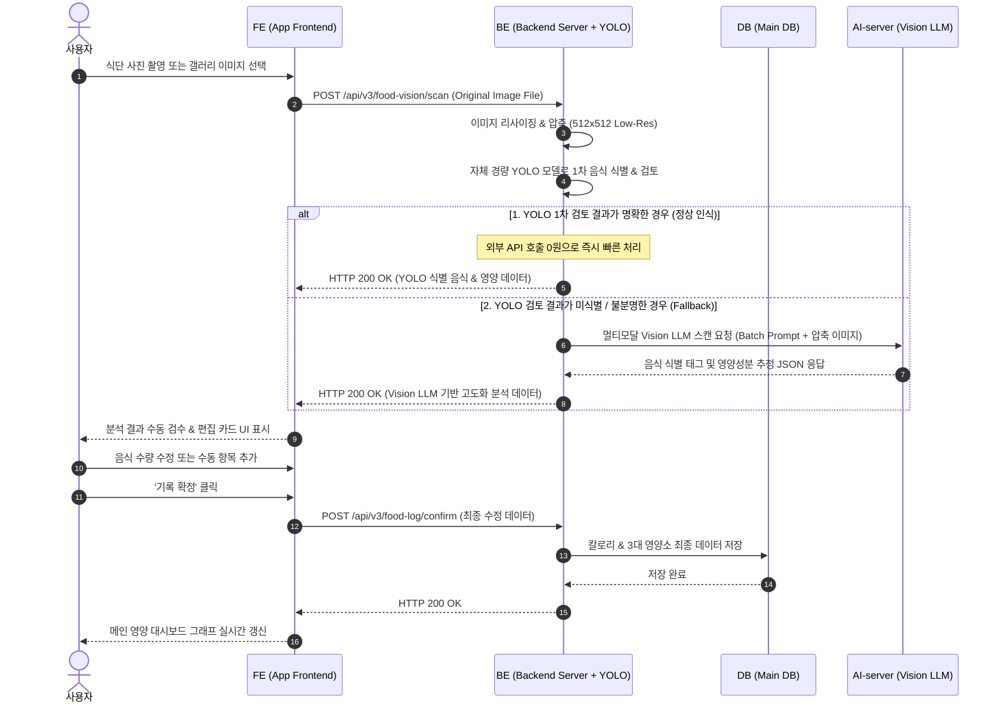
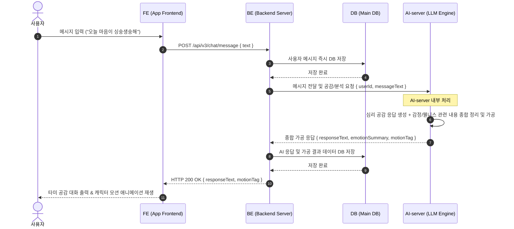
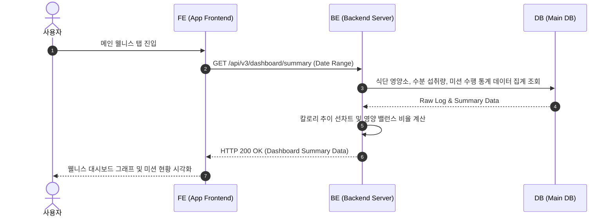
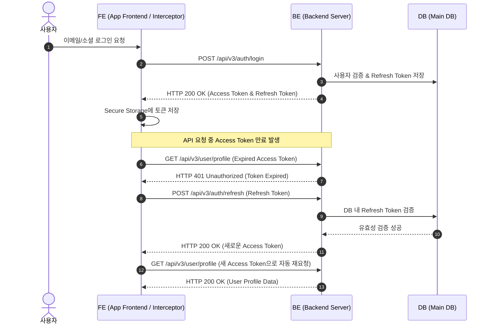
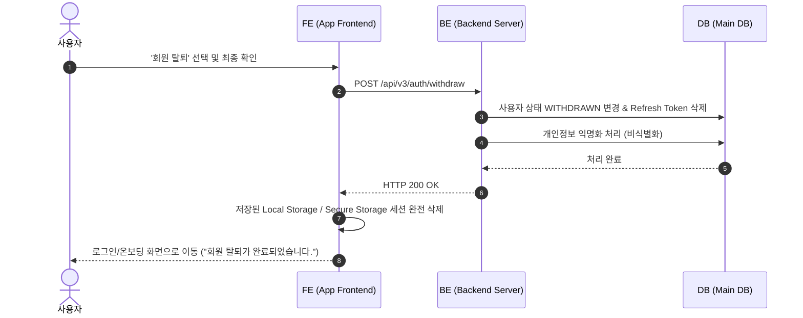

# TAMMY v3 시퀀스 다이어그램 (Sequence Diagrams)

본 문서는 FE, BE, DB, AI-server 간의 데이터 흐름과 시스템 간 인터랙션을 정의합니다.

---

## 1. 1-Tap 퀵버튼 기록 & 연료(Fuel) 충전 시퀀스

사용자가 1-Tap 퀵버튼으로 데일리 웰니스 항목을 기록하고 연료(Fuel)를 적립하는 과정입니다.

---

## 2. 별여행 탐사 & 비동기 AI 리포트 생성 및 푸시 알림 시퀀스

연료를 소진하여 별여행 탐사를 출발하고, AI-server가 행성 맞춤 리포트를 백그라운드에서 생성하여 푸시 알림으로 수령하는 과정입니다.

---

## 3. 사진 촬영 & Food Vision AI 영양 스캔 및 수동 검수 시퀀스

식단 사진 촬영 후 **BE 서버에서 이미지 압축** 및 **자체 경량 YOLO 모델로 1차 검토**를 수행하며, 인식이 불분명하거나 미식별 시에만 **AI-server(Vision LLM)로 추가 분석 요청**을 보내는 2단계 하이브리드 비전 흐름입니다.

---

## 4. AI 타미 심리 공감 대화 & AI-server 종합 가공 시퀀스

사용자 메시지를 DB에 저장한 뒤 바로 AI-server로 전달하고, AI-server에서 심리 공감 응답 및 관련 웰니스/맥락 내용을 모두 종합 정리하여 BE로 전달 후 처리하는 과정입니다.

---

## 6. 상시 웰니스 대시보드 통계 조회 시퀀스

메인 화면 진입 시 FE가 상시 웰니스 통계(칼로리 추이, 3대 영양소, 수분 섭취, 미션 달성도)를 조회하는 과정입니다.

---

## 7. JWT 로그인 & Access Token 자동 갱신 시퀀스

사용자 로그인 시 토큰 발급 및 API 요청 중 Access Token 만료 시 FE 인터셉터를 통해 Refresh Token으로 자동 재발급받는 과정입니다.

---

## 8. 회원 탈퇴 & 데이터 익명화 시퀀스

회원 탈퇴 요청 시 세션을 만료시키고 사용자 상태를 `WITHDRAWN`으로 변경하여 법적 정책에 따라 지연 삭제 및 익명화하는 과정입니다.

