# TAMMY v3 데이터 모델 및 데이터베이스 스키마 명세서 (Data Model & DB Schema)

본 문서는 TAMMY v3 서비스 백엔드의 데이터베이스 엔티티, ENUM 타입, 세부 컬럼 속성 및 관계를 정의한 전체 스키마 명세서입니다. `dbdiagram.dbml` 최신 정의와 100% 동일하게 작성되었습니다.

---

## 1. 개요 및 도메인별 엔티티 구성

```mermaid
erDiagram
    users ||--o| tammy_statuses : "1:1 소유"
    users ||--o{ user_body_logs : "신체 이력"
    users ||--o{ quick_logs : "1-Tap 데일리 기록"
    users ||--o{ chat_messages : "라이브 대화"
    users ||--o{ chat_message_archives : "영구 백업"
    users ||--o{ long_term_memories : "기억 캡슐"
    users ||--o{ meals : "식단"
    users ||--o{ exercise_logs : "운동 기록"
    users ||--o{ water_logs : "수분"
    users ||--o{ emotion_logs : "감정 로그"
    users ||--o{ activity_logs : "타임라인 피드"
    users ||--o{ planet_travels : "별여행 탐사"
    users ||--o{ reports : "맞춤 AI 리포트"

    planets ||--o| meal_planets : "1:1 식사별 조건"
    planets ||--o| water_planets : "1:1 수분별 조건"
    planets ||--o| emotion_planets : "1:1 감정별 조건"
    planets ||--o| lifestyle_planets : "1:1 생활습관별 조건"
    planets ||--o| retrospect_planets : "1:1 회고별 조건"
    planets ||--o{ planet_travels : "1:N 탐사 대상"
    planet_travels ||--o| reports : "1:1 리포트"

    meals ||--o{ meal_items : "세부 음식 항목"
    meals ||--o{ meal_images : "다중 사진"
    foods ||--o{ meal_items : "표준 영양 참조"
```

---

## 2. ENUM 타입 정의

| ENUM 이름 | 정의된 값 (Values) | 설명 |
| :--- | :--- | :--- |
| `AuthProvider` | `LOCAL`, `KAKAO`, `GOOGLE`, `APPLE` | 계정 인증 수단 |
| `UserStatus` | `ACTIVE`, `INACTIVE`, `WITHDRAWN` | 회원 계정 상태 |
| `Gender` | `MALE`, `FEMALE`, `OTHER` | 성별 |
| `LogCategory` | `WATER`, `EMOTION`, `JOURNAL`, `EXERCISE` | 1-Tap 퀵버튼 카테고리 |
| `PlanetType` | `MEAL`, `WATER`, `EMOTION`, `LIFESTYLE`, `RETROSPECT` | 5대 행성 카테고리 |
| `TravelStatus` | `IN_PROGRESS`, `COMPLETED`, `FAILED` | 탐사 진행 상태 |
| `Sender` | `USER`, `TAMMY` | 대화 메시지 발신자 |
| `MealType` | `BREAKFAST`, `LUNCH`, `DINNER`, `SNACK` | 식사 종류 |
| `EmotionState` | `HAPPY`, `SAD`, `ANGRY`, `STRESSED`, `CALM` | 기분/정서 상태 |

---

## 3. 세부 테이블 스키마 명세

### 3.1 사용자 & 타미 상태 도메인

#### 1) `users` (사용자 마스터)
| 컬럼명 | 데이터 타입 | 제약 조건 | 설명 |
| :--- | :--- | :--- | :--- |
| `id` | INT | PK, AUTO_INCREMENT | 사용자 고유 ID |
| `email` | VARCHAR(255) | UNIQUE, NOT NULL | 이메일 계정 |
| `password_hash` | VARCHAR(255) | NULLABLE | 비밀번호 해시 |
| `auth_provider` | ENUM(`AuthProvider`) | DEFAULT 'LOCAL' | 인증 수단 |
| `nickname` | VARCHAR(50) | NOT NULL | 닉네임 |
| `gender` | ENUM(`Gender`) | NULLABLE | 성별 |
| `age` | INT | NULLABLE | 나이 |
| `target_weight_kg` | DECIMAL(5,2) | NULLABLE | 목표 체중 (kg) |
| `preferred_exercise` | VARCHAR(100) | NULLABLE | 선호 운동 |
| `exercise_location` | VARCHAR(50) | NULLABLE | 운동 장소 |
| `preferred_exercise_time`| VARCHAR(50) | NULLABLE | 운동 시간대 |
| `water_goal_ml` | INT | DEFAULT 2000 | 일일 수분 목표 (ml) |
| `calorie_goal_kcal` | INT | DEFAULT 2000 | 일일 칼로리 목표 (kcal) |
| `current_fuel` | INT | DEFAULT 0 | 보유 연료량 (Fuel) |
| `refresh_token` | TEXT | NULLABLE | JWT Refresh Token |
| `status` | ENUM(`UserStatus`) | DEFAULT 'ACTIVE' | 계정 상태 |
| `last_login_at` | TIMESTAMP | NULLABLE | 최근 로그인 일시 |
| `created_at` | TIMESTAMP | DEFAULT CURRENT_TIMESTAMP | 계정 생성 일시 |
| `updated_at` | TIMESTAMP | DEFAULT CURRENT_TIMESTAMP | 계정 수정 일시 |

#### 2) `tammy_statuses` (타미 캐릭터 상태 - 1:1)
| 컬럼명 | 데이터 타입 | 제약 조건 | 설명 |
| :--- | :--- | :--- | :--- |
| `user_id` | INT | PK, FK (users.id) | 사용자 ID |
| `level` | INT | DEFAULT 1 | 관계 레벨 |
| `current_exp` | INT | DEFAULT 0 | 누적 경험치 |
| `empathy_index` | INT | DEFAULT 0 | 공감 지수 |
| `health_index` | INT | DEFAULT 0 | 건강 지수 |
| `activity_index` | INT | DEFAULT 0 | 활동 지수 |
| `happiness_index` | INT | DEFAULT 0 | 행복 지수 |
| `updated_at` | TIMESTAMP | DEFAULT CURRENT_TIMESTAMP | 갱신 일시 |

#### 3) `user_body_logs` (신체 정보 히스토리)
| 컬럼명 | 데이터 타입 | 제약 조건 | 설명 |
| :--- | :--- | :--- | :--- |
| `id` | BIGINT | PK, AUTO_INCREMENT | 신체 기록 ID |
| `user_id` | INT | FK (users.id) | 사용자 ID |
| `height_cm` | DECIMAL(5,2) | NOT NULL | 키 (cm) |
| `weight_kg` | DECIMAL(5,2) | NOT NULL | 체중 (kg) |
| `recorded_at` | TIMESTAMP | DEFAULT CURRENT_TIMESTAMP | 기록 일시 |

---

### 3.2 행성 마스터 & 5대 행성 1:1 특화 도메인

#### 1) `planets` (행성 마스터)
| 컬럼명 | 데이터 타입 | 제약 조건 | 설명 |
| :--- | :--- | :--- | :--- |
| `id` | INT | PK, AUTO_INCREMENT | 행성 ID |
| `name` | VARCHAR(100) | NOT NULL | 행성 이름 |
| `planet_type` | ENUM(`PlanetType`) | NOT NULL | 5대 행성 카테고리 |
| `required_fuel` | INT | DEFAULT 100 | 도착 필요 연료량 |
| `description` | TEXT | NULLABLE | 행성 설명 |
| `created_at` | TIMESTAMP | DEFAULT CURRENT_TIMESTAMP | 생성 일시 |

#### 2) `meal_planets` (식사별 특화 조건 - 1:1)
| 컬럼명 | 데이터 타입 | 제약 조건 | 설명 |
| :--- | :--- | :--- | :--- |
| `planet_id` | INT | PK, FK (planets.id) | 행성 ID |
| `target_calories_kcal` | INT | DEFAULT 0 | 목표 칼로리 |
| `target_carbohydrate_g` | DECIMAL(5,2) | DEFAULT 0.00 | 목표 탄수화물 (g) |
| `target_protein_g` | DECIMAL(5,2) | DEFAULT 0.00 | 목표 단백질 (g) |
| `target_fat_g` | DECIMAL(5,2) | DEFAULT 0.00 | 목표 지방 (g) |

#### 3) `water_planets` (수분별 특화 조건 - 1:1)
| 컬럼명 | 데이터 타입 | 제약 조건 | 설명 |
| :--- | :--- | :--- | :--- |
| `planet_id` | INT | PK, FK (planets.id) | 행성 ID |
| `target_water_ml` | INT | DEFAULT 2000 | 목표 수분 섭취량 |
| `min_intake_count` | INT | DEFAULT 4 | 최소 섭취 횟수 |

#### 4) `emotion_planets` (감정별 특화 조건 - 1:1)
| 컬럼명 | 데이터 타입 | 제약 조건 | 설명 |
| :--- | :--- | :--- | :--- |
| `planet_id` | INT | PK, FK (planets.id) | 행성 ID |
| `min_empathy_score` | INT | DEFAULT 0 | 최소 공감 점수 |
| `min_happiness_score` | INT | DEFAULT 0 | 최소 행복 점수 |

#### 5) `lifestyle_planets` (생활습관별 특화 조건 - 1:1)
| 컬럼명 | 데이터 타입 | 제약 조건 | 설명 |
| :--- | :--- | :--- | :--- |
| `planet_id` | INT | PK, FK (planets.id) | 행성 ID |
| `target_workout_duration`| INT | DEFAULT 30 | 목표 운동 시간 (분) |
| `daily_routine_target` | INT | DEFAULT 1 | 데일리 루틴 달성 목표 |

#### 6) `retrospect_planets` (회고별 자동 실행 조건 - 1:1)
| 컬럼명 | 데이터 타입 | 제약 조건 | 설명 |
| :--- | :--- | :--- | :--- |
| `planet_id` | INT | PK, FK (planets.id) | 행성 ID |
| `period_days` | INT | DEFAULT 7 | 회고 주기 (일) |
| `auto_trigger_cron` | VARCHAR(50) | DEFAULT '0 0 * * 0' | 자동 실행 타이머 |

#### 7) `planet_travels` (별여행 탐사 이력)
| 컬럼명 | 데이터 타입 | 제약 조건 | 설명 |
| :--- | :--- | :--- | :--- |
| `id` | BIGINT | PK, AUTO_INCREMENT | 탐사 기록 ID |
| `user_id` | INT | FK (users.id, NOT NULL) | 사용자 ID |
| `planet_id` | INT | FK (planets.id, NULLABLE) | 탐사 대상 행성 FK |
| `planet_type` | ENUM(`PlanetType`) | NOT NULL | 5대 탐사 행성 카테고리 |
| `fuel_spent` | INT | NOT NULL | 소진된 연료량 |
| `status` | ENUM(`TravelStatus`) | DEFAULT 'IN_PROGRESS' | 탐사 진행 상태 |
| `started_at` | TIMESTAMP | DEFAULT CURRENT_TIMESTAMP | 출발 일시 |
| `completed_at` | TIMESTAMP | NULLABLE | 복귀/완료 일시 |

---

### 3.3 1-Tap 퀵버튼 & 데일리 케어 도메인

#### 1) `quick_logs` (1-Tap 데일리 기록)
| 컬럼명 | 데이터 타입 | 제약 조건 | 설명 |
| :--- | :--- | :--- | :--- |
| `id` | BIGINT | PK, AUTO_INCREMENT | 기록 ID |
| `user_id` | INT | FK (users.id, NOT NULL) | 사용자 ID |
| `category` | ENUM(`LogCategory`) | NOT NULL | 기록 카테고리 |
| `amount` | INT | NULLABLE | 섭취 수분량 (ml) |
| `emotion_type` | VARCHAR(50) | NULLABLE | 감정 타입 |
| `journal_content` | TEXT | NULLABLE | 감정일기 본문 |
| `duration_minutes` | INT | NULLABLE | 운동 시간 (분) |
| `earned_fuel` | INT | DEFAULT 10 | 획득 연료 |
| `created_at` | TIMESTAMP | DEFAULT CURRENT_TIMESTAMP | 기록 일시 |

#### 2) `exercise_logs` (1-Tap 단순 운동 완 로그)
| 컬럼명 | 데이터 타입 | 제약 조건 | 설명 |
| :--- | :--- | :--- | :--- |
| `id` | BIGINT | PK, AUTO_INCREMENT | 운동 로그 ID |
| `user_id` | INT | FK (users.id) | 사용자 ID |
| `duration_minutes` | INT | DEFAULT 0 | 운동 시간 (분) |
| `burned_calories_kcal` | INT | DEFAULT 0 | 소모 칼로리 (kcal) |
| `is_completed` | BOOLEAN | DEFAULT TRUE | 1-Tap 운동 완료 여부 |
| `memo` | VARCHAR(255) | NULLABLE | 메모 |
| `performed_at` | TIMESTAMP | DEFAULT CURRENT_TIMESTAMP | 수행 일시 |

#### 3) `water_logs` (수분 섭취 로그)
| 컬럼명 | 데이터 타입 | 제약 조건 | 설명 |
| :--- | :--- | :--- | :--- |
| `id` | BIGINT | PK, AUTO_INCREMENT | 수분 로그 ID |
| `user_id` | INT | FK (users.id) | 사용자 ID |
| `intake_ml` | INT | NOT NULL, DEFAULT 250 | 섭취 수분량 (ml) |
| `recorded_at` | TIMESTAMP | DEFAULT CURRENT_TIMESTAMP | 기록 일시 |

#### 4) `emotion_logs` (감정 로그)
| 컬럼명 | 데이터 타입 | 제약 조건 | 설명 |
| :--- | :--- | :--- | :--- |
| `id` | BIGINT | PK, AUTO_INCREMENT | 감정 로그 ID |
| `user_id` | INT | FK (users.id) | 사용자 ID |
| `emotion_state` | ENUM(`EmotionState`) | NOT NULL | 감정 상태 |
| `cause_summary` | VARCHAR(255) | NULLABLE | 감정 원인 요약 |
| `recorded_at` | TIMESTAMP | DEFAULT CURRENT_TIMESTAMP | 기록 일시 |

---

### 3.4 식단 & 영양 마스터 도메인

#### 1) `foods` (표준 음식 영양 마스터)
| 컬럼명 | 데이터 타입 | 제약 조건 | 설명 |
| :--- | :--- | :--- | :--- |
| `id` | INT | PK, AUTO_INCREMENT | 음식 마스터 ID |
| `name` | VARCHAR(100) | UNIQUE, NOT NULL | 표준 음식명 |
| `standard_serving_g` | DECIMAL(6,2) | DEFAULT 100.00 | 제공량 (g) |
| `calories_kcal` | INT | DEFAULT 0 | 칼로리 |
| `carbohydrate_g` | DECIMAL(5,2) | DEFAULT 0.00 | 탄수화물 (g) |
| `protein_g` | DECIMAL(5,2) | DEFAULT 0.00 | 단백질 (g) |
| `fat_g` | DECIMAL(5,2) | DEFAULT 0.00 | 지방 (g) |

#### 2) `meals` (식단 기록 마스터)
| 컬럼명 | 데이터 타입 | 제약 조건 | 설명 |
| :--- | :--- | :--- | :--- |
| `id` | BIGINT | PK, AUTO_INCREMENT | 식단 기록 ID |
| `user_id` | INT | FK (users.id) | 사용자 ID |
| `meal_type` | ENUM(`MealType`) | NOT NULL | 식사 종류 |
| `comment` | VARCHAR(255) | NULLABLE | 식단 메모 |
| `total_calories_kcal` | INT | DEFAULT 0 | 총 칼로리 |
| `total_carbohydrate_g` | DECIMAL(5,2) | DEFAULT 0.00 | 탄수화물 (g) |
| `total_protein_g` | DECIMAL(5,2) | DEFAULT 0.00 | 단백질 (g) |
| `total_fat_g` | DECIMAL(5,2) | DEFAULT 0.00 | 지방 (g) |
| `registered_at` | TIMESTAMP | DEFAULT CURRENT_TIMESTAMP | 등록 일시 |

#### 3) `meal_images` (식단 사진)
| 컬럼명 | 데이터 타입 | 제약 조건 | 설명 |
| :--- | :--- | :--- | :--- |
| `id` | BIGINT | PK, AUTO_INCREMENT | 사진 ID |
| `meal_id` | BIGINT | FK (meals.id) | 식단 ID |
| `image_url` | VARCHAR(255) | NOT NULL | 사진 URL |
| `is_cover` | BOOLEAN | DEFAULT FALSE | 대표 사진 여부 |

#### 4) `meal_items` (세부 섭취 음식 항목)
| 컬럼명 | 데이터 타입 | 제약 조건 | 설명 |
| :--- | :--- | :--- | :--- |
| `id` | BIGINT | PK, AUTO_INCREMENT | 세부 항목 ID |
| `meal_id` | BIGINT | FK (meals.id) | 식단 ID |
| `food_id` | INT | NULLABLE, FK (foods.id) | 표준 음식 FK |
| `custom_food_name` | VARCHAR(100) | NOT NULL | 음식명 |
| `intake_gram` | DECIMAL(6,2) | DEFAULT 100.00 | 섭취 중량 (g) |
| `calories_kcal` | INT | DEFAULT 0 | 칼로리 |
| `carbohydrate_g` | DECIMAL(5,2) | DEFAULT 0.00 | 탄수화물 (g) |
| `protein_g` | DECIMAL(5,2) | DEFAULT 0.00 | 단백질 (g) |
| `fat_g` | DECIMAL(5,2) | DEFAULT 0.00 | 지방 (g) |

---

### 3.5 대화 & 리포트 도메인

#### 1) `chat_messages` (AI 타미 심리 공감 대화)
| 컬럼명 | 데이터 타입 | 제약 조건 | 설명 |
| :--- | :--- | :--- | :--- |
| `id` | BIGINT | PK, AUTO_INCREMENT | 메시지 ID |
| `user_id` | INT | FK (users.id) | 사용자 ID |
| `sender` | ENUM(`Sender`) | NOT NULL | 발신자 (USER / TAMMY) |
| `message_text` | TEXT | NOT NULL | 대화 메시지 본문 |
| `motion_tag` | VARCHAR(50) | NULLABLE | 반응 모션 태그 |
| `is_deleted` | BOOLEAN | DEFAULT FALSE | 5초 Undo 소프트 삭제 여부 |
| `is_edited` | BOOLEAN | DEFAULT FALSE | 수정 여부 |
| `created_at` | TIMESTAMP | DEFAULT CURRENT_TIMESTAMP | 전송 일시 |

#### 2) `reports` (맞춤 AI 인사이트 리포트)
| 컬럼명 | 데이터 타입 | 제약 조건 | 설명 |
| :--- | :--- | :--- | :--- |
| `id` | BIGINT | PK, AUTO_INCREMENT | 리포트 ID |
| `user_id` | INT | FK (users.id, NOT NULL) | 사용자 ID |
| `planet_travel_id` | BIGINT | UNIQUE, NULLABLE, FK (planet_travels.id) | 1:1 탐사 연동 |
| `planet_type` | ENUM(`PlanetType`) | NOT NULL | 행성 테마 |
| `title` | VARCHAR(255) | NOT NULL | 리포트 제목 |
| `summary_content` | TEXT | NOT NULL | AI 진단 요약 |
| `recommendations` | TEXT | NOT NULL | 추천 가이드라인 |
| `created_at` | TIMESTAMP | DEFAULT CURRENT_TIMESTAMP | 생성 일시 |
