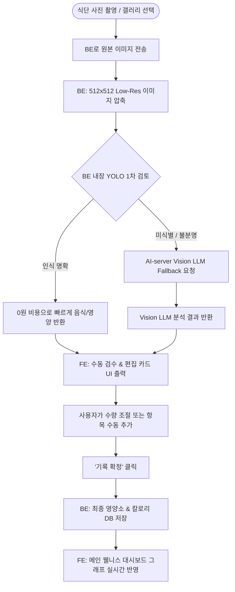
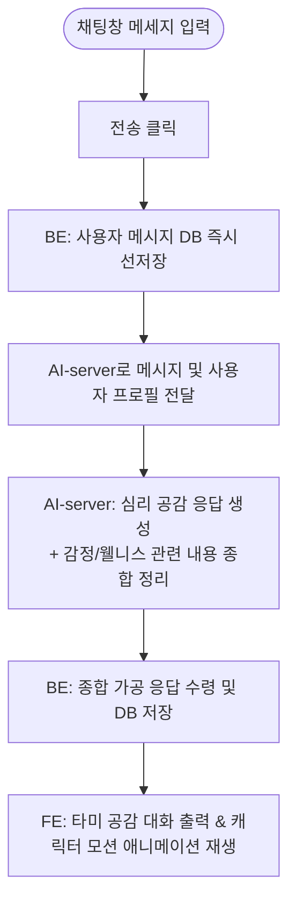

# TAMMY v3 사용자 유저 플로우 (User Flow)

본 문서는 TAMMY v3의 핵심 사용자 경로 및 시스템 인터랙션 플로우를 정의합니다.

---

## 1. 1-Tap 퀵버튼 데일리 기록 & 연료 충전 플로우

```mermaid
flowchart TD
    Start([사용자 메인 화면 진입]) --> QuickTap{1-Tap 퀵버튼 선택}
    
    QuickTap -->|기능 실행| Action[사진 촬영 또는 리포트 생성]
    QuickTap -->|기록| Record[물 / 감정 / 감정일기 / 운동]

    Record --> Input[원터치 수량 입력 또는 선택]
    Input --> BE_Save[BE: DB 기록 저장 & 연료 +10 Fuel 적립]
    BE_Save --> UI_Toast[FE: "기록 완료! 연료 +10 충전" Toast 표시]
    UI_Toast --> End([연료 총량 갱신 완료])
```

---

## 2. Food Vision 사진 촬영 & 영양 스캔 플로우



---

## 3. 별여행 탐사 출발 & 비동기 리포트 수령 플로우

```mermaid
flowchart TD
    Start([별여행 탭 진입]) --> FuelCheck{보유 연료 확인}
    FuelCheck -->|연료 부족| EarnFuel[1-Tap 퀵버튼 미션 수행으로 연료 충전]
    FuelCheck -->|연료 충분| SelectPlanet[5대 행성 중 선택\n(식사/수분/감정/생활습관/회고)]

    SelectPlanet --> StartTravel['별여행 출발' 클릭]
    StartTravel --> BE_Deduct[BE: 연료 차감 & 탐사 IN_PROGRESS 기록]
    BE_Deduct --> TaskPush[BE: Task Queue에 리포트 생성 작업 Push]
    TaskPush --> UI_Notify[FE: "별여행을 떠났어요! 완료 시 알림을 보내드려요."]

    subgraph Async Background Worker
        TaskPush --> Worker[Worker: 해당 행성 데이터 수집 및 AI-server 리포트 요청]
        Worker --> ReportSave[리포트 DB 저장 & 탐사 COMPLETED 갱신]
        ReportSave --> PushNotification[FCM/APNs 푸시 알림 발송]
    end

    PushNotification --> ClickPush[사용자가 푸시 알림 클릭]
    ClickPush --> DetailView[FE: 행성 맞춤 AI 인사이트 리포트 상세 화면 표시]
```

---

## 4. AI 타미 심리 공감 대화 플로우



---

## 5. 대화 삭제 & Undo 복구 플로우

```mermaid
flowchart TD
    Start([대화 메시지 '삭제' 클릭]) --> BE_SoftDelete[BE: 소프트 삭제 처리]
    BE_SoftDelete --> UndoToast[FE: "메시지가 삭제되었습니다. [실행 취소]"]
    
    UndoToast --> UserChoice{5초 내 Undo 클릭 여부}
    UserChoice -->|실행 취소 클릭| Restore[BE: 복구 API 호출 & DB 복원]
    Restore --> UI_Restored[FE: 대화 메시지 화면 복원]
    UserChoice -->|시간 경과| EndDelete[Toast 자동 종료 & 삭제 확정]
```
