# TAMMY Database Schema (v3)

본 문서는 MySQL 기반의 TAMMY 서비스 테이블 설계서입니다. 외래 키 제약 조건 및 정규화 규칙을 고려하여 설계되었습니다.

---

## 1. DDL (Data Definition Language) SQL 작성

### 1.1 사용자 및 캐릭터 상태
```sql
CREATE TABLE users (
    id INT AUTO_INCREMENT PRIMARY KEY,
    nickname VARCHAR(50) NOT NULL,
    gender ENUM('MALE', 'FEMALE', 'OTHER') NULL,
    age INT NULL,
    target_weight_kg DECIMAL(5,2) NULL, -- [네이밍 개선] 단위 접미사 명시 (_kg)
    preferred_exercise VARCHAR(100) NULL,
    exercise_location VARCHAR(50) NULL,
    preferred_exercise_time VARCHAR(50) NULL, -- [네이밍 개선] 용도 명확화
    created_at TIMESTAMP DEFAULT CURRENT_TIMESTAMP,
    updated_at TIMESTAMP DEFAULT CURRENT_TIMESTAMP ON UPDATE CURRENT_TIMESTAMP
);

-- [네이밍 개선] tammy_status 단수형 명칭을 복수형인 tammy_statuses로 변경
CREATE TABLE tammy_statuses (
    user_id INT PRIMARY KEY,
    level INT DEFAULT 1,
    current_exp INT DEFAULT 0,
    empathy_index INT DEFAULT 0,
    health_index INT DEFAULT 0,
    activity_index INT DEFAULT 0,
    happiness_index INT DEFAULT 0,
    updated_at TIMESTAMP DEFAULT CURRENT_TIMESTAMP ON UPDATE CURRENT_TIMESTAMP,
    FOREIGN KEY (user_id) REFERENCES users(id) ON DELETE CASCADE
);

CREATE TABLE user_body_logs (
    id BIGINT AUTO_INCREMENT PRIMARY KEY,
    user_id INT NOT NULL,
    height_cm DECIMAL(5,2) NOT NULL, -- [네이밍 개선] 단위 접미사 명시 (_cm)
    weight_kg DECIMAL(5,2) NOT NULL, -- [네이밍 개선] 단위 접미사 명시 (_kg)
    recorded_at TIMESTAMP DEFAULT CURRENT_TIMESTAMP,
    FOREIGN KEY (user_id) REFERENCES users(id) ON DELETE CASCADE,
    INDEX idx_user_body_recorded (user_id, recorded_at DESC) -- [성능 개선] 복합 인덱스 추가
);
```

### 1.2 행성 및 도메인 상속 테이블 (Class Table Inheritance)
```sql
CREATE TABLE planets (
    id INT AUTO_INCREMENT PRIMARY KEY,
    name VARCHAR(100) NOT NULL,
    planet_type ENUM('EXERCISE', 'NUTRITION', 'EMOTION', 'CHALLENGE') NOT NULL,
    required_fuel INT DEFAULT 100,
    description TEXT NULL,
    created_at TIMESTAMP DEFAULT CURRENT_TIMESTAMP,
    UNIQUE KEY uq_planet_type (id, planet_type)
);

-- [오류 해결] 자식 테이블 가상 생성 컬럼의 타입을 부모와 일치하도록 ENUM으로 정정하여 MySQL ERROR 3780 빌드 실패 해결
CREATE TABLE exercise_planets (
    planet_id INT PRIMARY KEY,
    target_workout_count INT DEFAULT 0,
    target_duration_minutes INT DEFAULT 0,
    preferred_category VARCHAR(50) NULL,
    planet_type ENUM('EXERCISE', 'NUTRITION', 'EMOTION', 'CHALLENGE') GENERATED ALWAYS AS ('EXERCISE') STORED,
    FOREIGN KEY (planet_id, planet_type) REFERENCES planets(id, planet_type) ON DELETE CASCADE
);

CREATE TABLE nutrition_planets (
    planet_id INT PRIMARY KEY,
    target_calories_kcal INT DEFAULT 0,
    target_carbohydrate_g DECIMAL(5,2) DEFAULT 0.00, -- [네이밍 개선] 단위 접미사 명시 (_g)
    target_protein_g DECIMAL(5,2) DEFAULT 0.00,      -- [네이밍 개선] 단위 접미사 명시 (_g)
    target_fat_g DECIMAL(5,2) DEFAULT 0.00,          -- [네이밍 개선] 단위 접미사 명시 (_g)
    planet_type ENUM('EXERCISE', 'NUTRITION', 'EMOTION', 'CHALLENGE') GENERATED ALWAYS AS ('NUTRITION') STORED,
    FOREIGN KEY (planet_id, planet_type) REFERENCES planets(id, planet_type) ON DELETE CASCADE
);

CREATE TABLE emotion_planets (
    planet_id INT PRIMARY KEY,
    min_empathy_score INT DEFAULT 0,
    min_happiness_score INT DEFAULT 0,
    planet_type ENUM('EXERCISE', 'NUTRITION', 'EMOTION', 'CHALLENGE') GENERATED ALWAYS AS ('EMOTION') STORED,
    FOREIGN KEY (planet_id, planet_type) REFERENCES planets(id, planet_type) ON DELETE CASCADE
);

CREATE TABLE challenge_planets (
    planet_id INT PRIMARY KEY,
    challenge_description TEXT NULL,
    reward_badge_name VARCHAR(100) NULL,
    planet_type ENUM('EXERCISE', 'NUTRITION', 'EMOTION', 'CHALLENGE') GENERATED ALWAYS AS ('CHALLENGE') STORED,
    FOREIGN KEY (planet_id, planet_type) REFERENCES planets(id, planet_type) ON DELETE CASCADE
);
```

### 1.3 대화 기록 및 장기기억
```sql
CREATE TABLE chat_messages (
    id BIGINT AUTO_INCREMENT PRIMARY KEY,
    user_id INT NOT NULL,
    sender ENUM('USER', 'TAMMY') NOT NULL,
    message_text TEXT NOT NULL,
    is_edited BOOLEAN DEFAULT FALSE,
    created_at TIMESTAMP DEFAULT CURRENT_TIMESTAMP,
    updated_at TIMESTAMP DEFAULT CURRENT_TIMESTAMP ON UPDATE CURRENT_TIMESTAMP,
    FOREIGN KEY (user_id) REFERENCES users(id) ON DELETE CASCADE,
    INDEX idx_user_msg_created (user_id, created_at DESC) -- [성능 개선] 복합 인덱스 추가
);

CREATE TABLE chat_message_edits (
    id BIGINT AUTO_INCREMENT PRIMARY KEY,
    chat_message_id BIGINT NOT NULL, -- [네이밍 개선] 외래 키 정교화 (message_id -> chat_message_id)
    previous_text TEXT NOT NULL,
    edited_at TIMESTAMP DEFAULT CURRENT_TIMESTAMP,
    FOREIGN KEY (chat_message_id) REFERENCES chat_messages(id) ON DELETE CASCADE
);

CREATE TABLE long_term_memories (
    id INT AUTO_INCREMENT PRIMARY KEY,
    user_id INT NOT NULL,
    category VARCHAR(50) NOT NULL,
    memory_content TEXT NOT NULL,
    importance_score INT DEFAULT 1,
    created_at TIMESTAMP DEFAULT CURRENT_TIMESTAMP,
    updated_at TIMESTAMP DEFAULT CURRENT_TIMESTAMP ON UPDATE CURRENT_TIMESTAMP,
    FOREIGN KEY (user_id) REFERENCES users(id) ON DELETE CASCADE,
    UNIQUE KEY uq_user_category (user_id, category) -- [성능 개선] 중복 인덱스를 방지하고 유니크 속성을 담아 대체
);
```

### 1.4 건강 및 활동 로그
```sql
CREATE TABLE exercises (
    id INT AUTO_INCREMENT PRIMARY KEY,
    name VARCHAR(100) NOT NULL UNIQUE,
    met_value DECIMAL(4,2) DEFAULT 1.00,
    category VARCHAR(50) NULL,
    created_at TIMESTAMP DEFAULT CURRENT_TIMESTAMP
);

CREATE TABLE exercise_logs (
    id BIGINT AUTO_INCREMENT PRIMARY KEY,
    user_id INT NOT NULL,
    exercise_id INT NOT NULL,
    duration_minutes INT NOT NULL,
    burned_calories_kcal INT DEFAULT 0, -- [네이밍 개선] 단위 접미사 명시 (_kcal)
    is_completed BOOLEAN DEFAULT TRUE,
    performed_at TIMESTAMP DEFAULT CURRENT_TIMESTAMP,
    FOREIGN KEY (user_id) REFERENCES users(id) ON DELETE CASCADE,
    FOREIGN KEY (exercise_id) REFERENCES exercises(id) ON DELETE RESTRICT,
    INDEX idx_user_exercise_performed (user_id, performed_at DESC) -- [성능 개선] 복합 인덱스 추가
);

CREATE TABLE meals (
    id BIGINT AUTO_INCREMENT PRIMARY KEY,
    user_id INT NOT NULL,
    meal_type ENUM('BREAKFAST', 'LUNCH', 'DINNER', 'SNACK') NOT NULL,
    image_url VARCHAR(255) NULL,
    comment VARCHAR(255) NULL,
    -- [성능 개선/역정규화] 자식 테이블 SUM 비효율을 해소하기 위한 영양소 합계 컬럼 적재
    total_calories_kcal INT DEFAULT 0,
    total_carbohydrate_g DECIMAL(5,2) DEFAULT 0.00,
    total_protein_g DECIMAL(5,2) DEFAULT 0.00,
    total_fat_g DECIMAL(5,2) DEFAULT 0.00,
    registered_at TIMESTAMP DEFAULT CURRENT_TIMESTAMP,
    FOREIGN KEY (user_id) REFERENCES users(id) ON DELETE CASCADE,
    INDEX idx_user_meal_registered (user_id, registered_at DESC) -- [성능 개선] 복합 인덱스 추가
);

CREATE TABLE meal_items (
    id BIGINT AUTO_INCREMENT PRIMARY KEY,
    meal_id BIGINT NOT NULL,
    food_name VARCHAR(100) NOT NULL,
    calories_kcal INT DEFAULT 0,       -- [네이밍 개선] 단위 접미사 명시 (_kcal)
    carbohydrate_g DECIMAL(5,2) DEFAULT 0.00, -- [네이밍 개선] 단위 접미사 명시 (_g)
    protein_g DECIMAL(5,2) DEFAULT 0.00,      -- [네이밍 개선] 단위 접미사 명시 (_g)
    fat_g DECIMAL(5,2) DEFAULT 0.00,          -- [네이밍 개선] 단위 접미사 명시 (_g)
    FOREIGN KEY (meal_id) REFERENCES meals(id) ON DELETE CASCADE
);

CREATE TABLE water_logs (
    id BIGINT AUTO_INCREMENT PRIMARY KEY,
    user_id INT NOT NULL,
    intake_ml INT NOT NULL,
    recorded_at TIMESTAMP DEFAULT CURRENT_TIMESTAMP,
    FOREIGN KEY (user_id) REFERENCES users(id) ON DELETE CASCADE,
    INDEX idx_user_water_recorded (user_id, recorded_at DESC) -- [성능 개선] 복합 인덱스 추가
);

CREATE TABLE emotion_logs (
    id BIGINT AUTO_INCREMENT PRIMARY KEY,
    user_id INT NOT NULL,
    emotion_state ENUM('HAPPY', 'SAD', 'ANGRY', 'STRESSED', 'CALM') NOT NULL,
    cause_summary VARCHAR(255) NULL,
    recorded_at TIMESTAMP DEFAULT CURRENT_TIMESTAMP,
    FOREIGN KEY (user_id) REFERENCES users(id) ON DELETE CASCADE,
    INDEX idx_user_emotion_recorded (user_id, recorded_at DESC) -- [성능 개선] 복합 인덱스 추가
);
```

### 1.5 통합 활동 로그 및 타임라인 시스템 (Unified Activity Logs)
```sql
-- [성능 개선/역정규화] 5중 OUTER JOIN으로 인한 조회 마비를 해결하기 위해 상세 정보를 JSON 컬럼 스냅샷으로 적재하는 방식으로 대안 변경
CREATE TABLE activity_logs (
    id BIGINT AUTO_INCREMENT PRIMARY KEY,
    user_id INT NOT NULL,
    activity_type ENUM('BODY_SPEC', 'EXERCISE', 'MEAL', 'WATER', 'EMOTION') NOT NULL,
    activity_details JSON NOT NULL, -- 개별 로그의 스냅샷 데이터 적재 (Join 제거)
    recorded_at TIMESTAMP DEFAULT CURRENT_TIMESTAMP,
    FOREIGN KEY (user_id) REFERENCES users(id) ON DELETE CASCADE,
    INDEX idx_user_activity_recorded (user_id, recorded_at DESC) -- [성능 개선] 복합 인덱스 추가
);
```

### 1.6 능동형 에이전트 시스템 (Proactive Agent System)
```sql
CREATE TABLE proactive_triggers (
    id BIGINT AUTO_INCREMENT PRIMARY KEY,
    user_id INT NOT NULL,
    trigger_type ENUM('NEG_EMOTION', 'NO_WATER', 'NO_EXERCISE', 'SYSTEM') NOT NULL,
    reference_id BIGINT NULL,
    message_text TEXT NOT NULL,
    status ENUM('PENDING', 'SENT', 'RESPONDED', 'EXPIRED') DEFAULT 'PENDING',
    created_at TIMESTAMP DEFAULT CURRENT_TIMESTAMP,
    triggered_at TIMESTAMP NULL,
    resolved_at TIMESTAMP NULL,
    FOREIGN KEY (user_id) REFERENCES users(id) ON DELETE CASCADE,
    INDEX idx_user_trigger_created (user_id, created_at DESC) -- [성능 개선] 복합 인덱스 추가
);
```

### 1.7 우주여행 시스템
```sql
CREATE TABLE space_travel_states (
    user_id INT PRIMARY KEY,
    current_fuel INT DEFAULT 0,
    ship_coordinate_x DECIMAL(8,4) DEFAULT 0.0000,
    ship_coordinate_y DECIMAL(8,4) DEFAULT 0.0000,
    current_planet_id INT DEFAULT 1,
    updated_at TIMESTAMP DEFAULT CURRENT_TIMESTAMP ON UPDATE CURRENT_TIMESTAMP,
    FOREIGN KEY (user_id) REFERENCES users(id) ON DELETE CASCADE,
    FOREIGN KEY (current_planet_id) REFERENCES planets(id)
);

CREATE TABLE planet_histories (
    id INT AUTO_INCREMENT PRIMARY KEY,
    user_id INT NOT NULL,
    planet_id INT NOT NULL,
    reached_at TIMESTAMP DEFAULT CURRENT_TIMESTAMP,
    growth_summary TEXT NULL,
    FOREIGN KEY (user_id) REFERENCES users(id) ON DELETE CASCADE,
    FOREIGN KEY (planet_id) REFERENCES planets(id),
    INDEX idx_user_planet_reached (user_id, reached_at DESC)
);
```

### 1.8 건강 리포트
```sql
CREATE TABLE monthly_reports (
    id INT AUTO_INCREMENT PRIMARY KEY,
    user_id INT NOT NULL,
    report_year_month CHAR(7) NOT NULL,
    health_score INT DEFAULT 0,
    summary_content TEXT NULL,
    aggregated_data JSON NULL,
    created_at TIMESTAMP DEFAULT CURRENT_TIMESTAMP,
    FOREIGN KEY (user_id) REFERENCES users(id) ON DELETE CASCADE,
    UNIQUE KEY uq_user_month (user_id, report_year_month),
    CONSTRAINT chk_report_year_month CHECK (report_year_month REGEXP '^[0-9]{4}-[0-9]{2}$')
);
```

---

## 2. Mermaid ERD 다이어그램

```mermaid
erDiagram
    users {
        int id PK
        enum gender
        varchar nickname
        int age
        decimal target_weight_kg
        varchar preferred_exercise
        varchar exercise_location
        varchar preferred_exercise_time
        timestamp created_at
        timestamp updated_at
    }

    user_body_logs {
        bigint id PK
        int user_id FK
        decimal height_cm
        decimal weight_kg
        timestamp recorded_at
    }

    tammy_statuses {
        int user_id PK, FK "1:1 필수 관계"
        int level
        int current_exp
        int empathy_index
        int health_index
        int activity_index
        int happiness_index
        timestamp updated_at
    }

    planets {
        int id PK "복합 고유키 대상"
        varchar name
        enum planet_type "복합 고유키 대상"
        int required_fuel
        text description
        timestamp created_at
    }

    exercise_planets {
        int planet_id PK, FK "배타적 복합 FK"
        int target_workout_count
        int target_duration_minutes
        varchar preferred_category
        enum planet_type "부모 ENUM 상속"
    }

    nutrition_planets {
        int planet_id PK, FK "배타적 복합 FK"
        int target_calories_kcal
        decimal target_carbohydrate_g
        decimal target_protein_g
        decimal target_fat_g
        enum planet_type "부모 ENUM 상속"
    }

    emotion_planets {
        int planet_id PK, FK "배타적 복합 FK"
        int min_empathy_score
        int min_happiness_score
        enum planet_type "부모 ENUM 상속"
    }

    challenge_planets {
        int planet_id PK, FK "배타적 복합 FK"
        text challenge_description
        varchar reward_badge_name
        enum planet_type "부모 ENUM 상속"
    }

    chat_messages {
        bigint id PK
        int user_id FK
        enum sender
        text message_text
        boolean is_edited
        timestamp created_at
        timestamp updated_at
    }

    chat_message_edits {
        bigint id PK
        bigint chat_message_id FK
        text previous_text
        timestamp edited_at
    }

    long_term_memories {
        int id PK
        int user_id FK
        varchar category
        text memory_content
        int importance_score
        timestamp created_at
        timestamp updated_at
    }

    exercises {
        int id PK
        varchar name
        decimal met_value
        varchar category
        timestamp created_at
    }

    exercise_logs {
        bigint id PK
        int user_id FK
        int exercise_id FK
        int duration_minutes
        int burned_calories_kcal
        boolean is_completed
        timestamp performed_at
    }

    meals {
        bigint id PK
        int user_id FK
        enum meal_type
        varchar image_url
        varchar comment
        int total_calories_kcal "반정규화 캐시"
        decimal total_carbohydrate_g "반정규화 캐시"
        decimal total_protein_g "반정규화 캐시"
        decimal total_fat_g "반정규화 캐시"
        timestamp registered_at
    }

    meal_items {
        bigint id PK
        bigint meal_id FK
        varchar food_name
        int calories_kcal
        decimal carbohydrate_g
        decimal protein_g
        decimal fat_g
    }

    water_logs {
        bigint id PK
        int user_id FK
        int intake_ml
        timestamp recorded_at
    }

    emotion_logs {
        bigint id PK
        int user_id FK
        enum emotion_state
        varchar cause_summary
        timestamp recorded_at
    }

    activity_logs {
        bigint id PK
        int user_id FK
        enum activity_type
        json activity_details "JSON 역정규화 스냅샷"
        timestamp recorded_at
    }

    proactive_triggers {
        bigint id PK
        int user_id FK
        enum trigger_type
        bigint reference_id
        text message_text
        enum status
        timestamp created_at
        timestamp triggered_at
        timestamp resolved_at
    }

    space_travel_states {
        int user_id PK, FK "1:1 필수 관계"
        int current_fuel
        decimal ship_coordinate_x
        decimal ship_coordinate_y
        int current_planet_id FK
        timestamp updated_at
    }

    planet_histories {
        int id PK
        int user_id FK
        int planet_id FK
        timestamp reached_at
        text growth_summary
    }

    monthly_reports {
        int id PK
        int user_id FK
        char report_year_month
        int health_score
        text summary_content
        json aggregated_data
        timestamp created_at
    }

    users ||--|| tammy_statuses : "has_strictly_one"
    users ||--o{ user_body_logs : "has_history"
    users ||--o{ chat_messages : "sends"
    chat_messages ||--o{ chat_message_edits : "has_edits_history"
    users ||--o{ long_term_memories : "remembers"
    users ||--o{ meals : "eats"
    meals ||--o{ meal_items : "contains"
    users ||--o{ exercise_logs : "logs_exercise"
    exercises ||--o{ exercise_logs : "defines_intensity"
    users ||--o{ water_logs : "logs_water"
    users ||--o{ emotion_logs : "logs_emotion"
    users ||--|| space_travel_states : "travels_strictly_one"
    users ||--o{ planet_histories : "visits"
    users ||--o{ monthly_reports : "gets"

    users ||--o{ activity_logs : "tracks"
    users ||--o{ proactive_triggers : "proactively_triggers"

    planets ||--|| exercise_planets : "inherits (EXERCISE)"
    planets ||--|| nutrition_planets : "inherits (NUTRITION)"
    planets ||--|| emotion_planets : "inherits (EMOTION)"
    planets ||--|| challenge_planets : "inherits (CHALLENGE)"
    planets ||--o{ space_travel_states : "destination_for"
    planets ||--o{ planet_histories : "recorded_as"
```


